# Configuración del Servicio de Embeddings en Azure

El proyecto rag_fds utiliza los modelos de Embeddings de OpenAI alojados en la infraestructura de Microsoft Azure para vectorizar el texto de las Fichas de Datos de Seguridad.

---

## 1. Requisitos Previos y Cuenta de Estudiante

Puedes realizar este proceso con una cuenta de Azure normal o una de estudiante.

Si eres estudiante universitario: ¡No uses tu tarjeta de crédito! Microsoft ofrece Azure for Students, que te da $100 de crédito gratuito y acceso a servicios populares sin costo.

Link de registro: https://azure.microsoft.com/en-us/free/students

---

## PASO 1: Buscar el Servicio en el Portal

1. Inicia sesión en el Portal de Azure.

2. En la barra de búsqueda superior, escribe OpenAI.

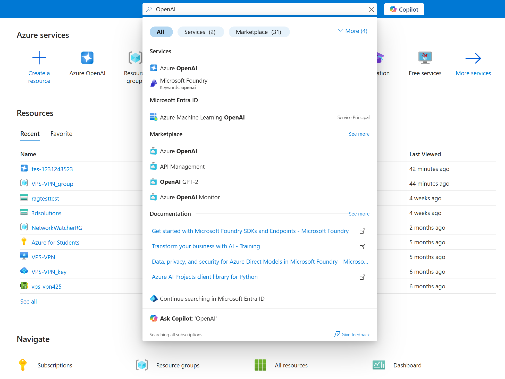

3. Selecciona el servicio que dice Azure OpenAI (el icono es un hexágono azul con el logo de OpenAI).

---

## PASO 2: Iniciar la Creación y Configurar "Basics"

En la siguiente pantalla, verás el panel de control de Azure OpenAI. Si no tienes ninguno creado, verás un mensaje indicándolo.

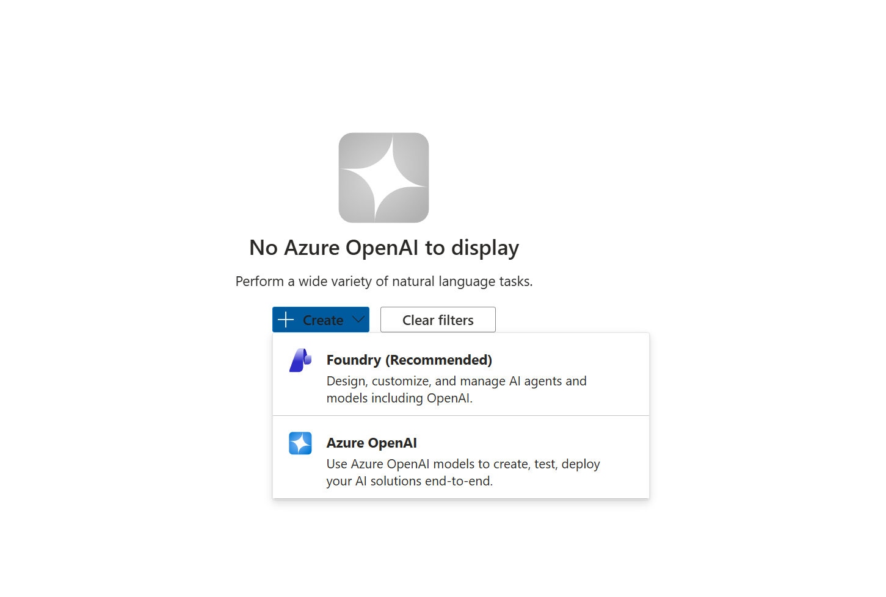

Haz clic en el botón + Create.

Selecionas Azure OpenAI, no Foundry 

Verás el formulario de creación. Completa la pestaña Basics:

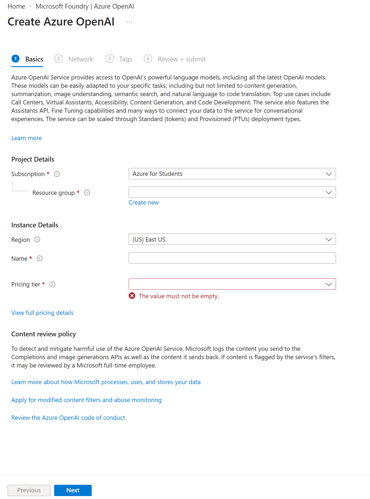

- Subscription: Asegúrate de seleccionar Azure for Students si aplicaste a ese beneficio, o tu suscripción activa.
- Resource group: Haz clic en "Create new" (Crear nuevo) y dale un nombre, por ejemplo: rg-rag-fds.
- Region: Selecciona East US.
>[!NOTE]
>Si aparece una falla en la revision es por el tipo de region probar con las siguientes:
>* Central US
>* UK  South
>* East US
>* West Europe
>* Canada Central
>* Otras en caso de que fallen estas

- Name: Este nombre debe ser único en todo Azure. Puedes usar algo como: openai-rag-fds-[tu-nombre].
- Pricing tier: Selecciona Standard S0.


---

## PASO 3: Configurar la Red (Networking)

Haz clic en Next (Siguiente) para ir a la pestaña Network.

Selecciona la opción:

> All networks, including the internet, can access this resource

Nota: Esto es lo más sencillo para desarrollo. Para producción, se recomienda restringirlo más adelante.

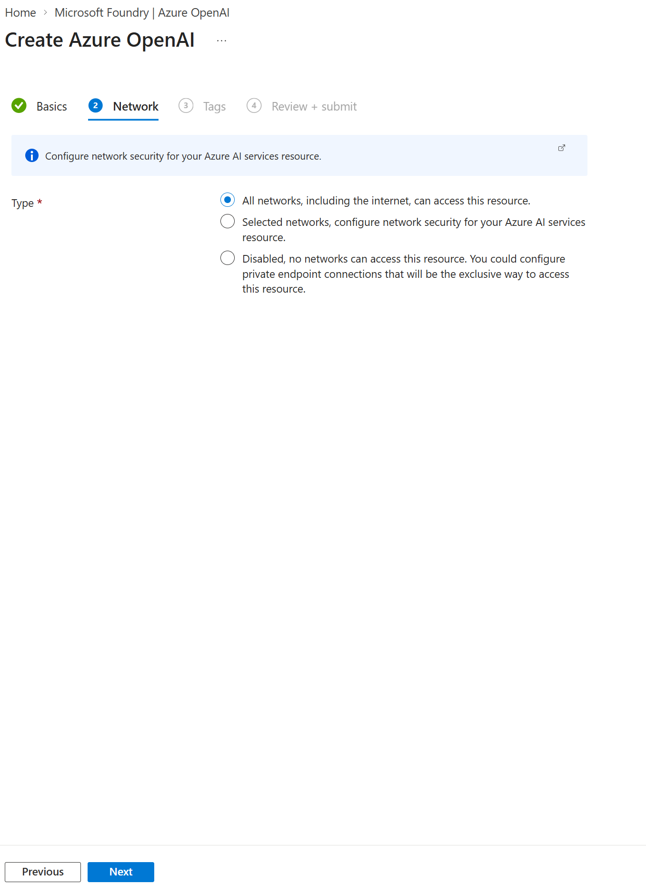

---

## PASO 4: Opcional - Etiquetas (Tags)

Puedes saltar este paso haciendo clic directamente en Next. Las etiquetas sirven para organizar y asignar costos si tienes muchos recursos.

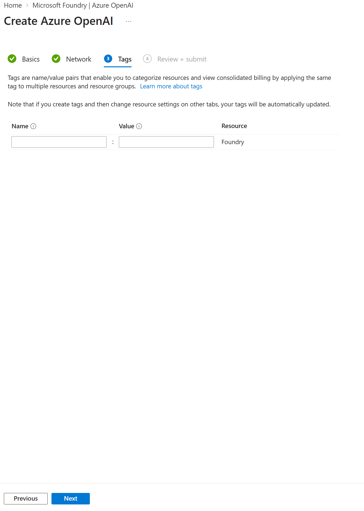

---

## PASO 5: Revisar y Finalizar el Despliegue

Azure verificará que todos los datos sean correctos.

Haz clic en Next hasta llegar a la pestaña Review + Submit.

Verás un resumen de la configuración.

Haz clic en el botón azul Create (Crear).

Espera unos minutos hasta ver:

> "Your deployment is complete"

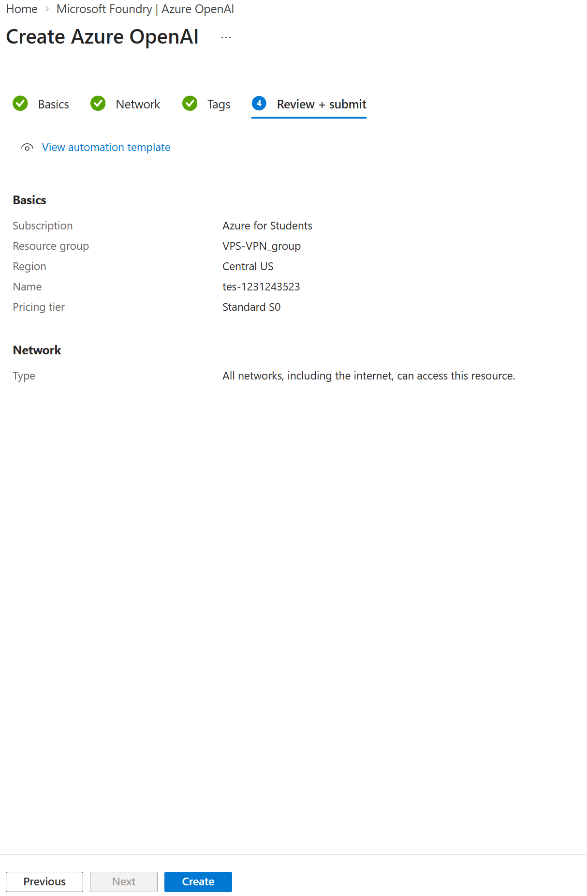

---

## PASO 6: Confirmación del Despliegue

Haz clic en el botón azul Go to resource.

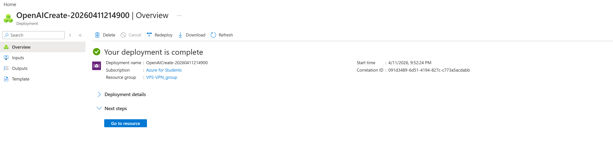

---

## PASO 7: Acceso al AI Foundry

Dentro del recurso de Azure OpenAI:

Haz clic en el botón Explore Foundry portal.

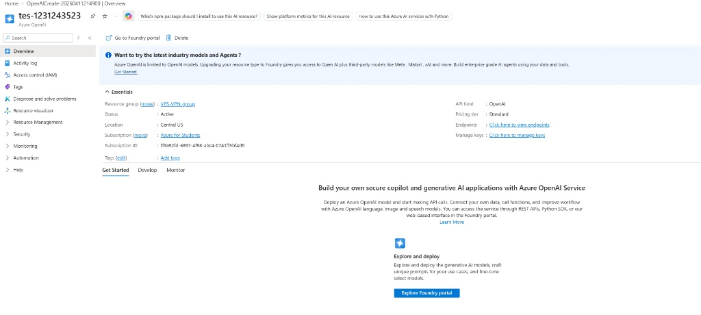

---

## PASO 8: Crear una Implementación (Deployment)

Al entrar al Foundry, estarás en el "Área de juegos" (Playground).


* Haz clic en el panel lateral Catálogo de modelos, ya que no nos interesa implementar un modelo por ahora

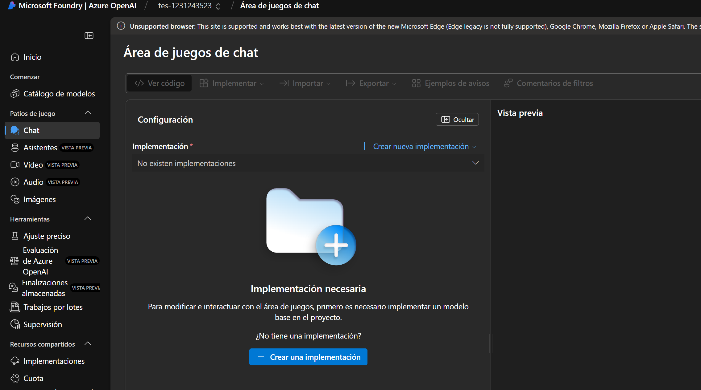

---

## PASO 9: Selección del Modelo de Embeddings

* Se abrirá el Catálogo de modelos. Aquí verás todos los modelos disponibles (GPT-4, GPT-3.5, etc.). 

* En la barra de búsqueda, escribe la palabra "embeddings". 

* Selecciona el modelo text-embedding-3-large (recomendado por su eficiencia).

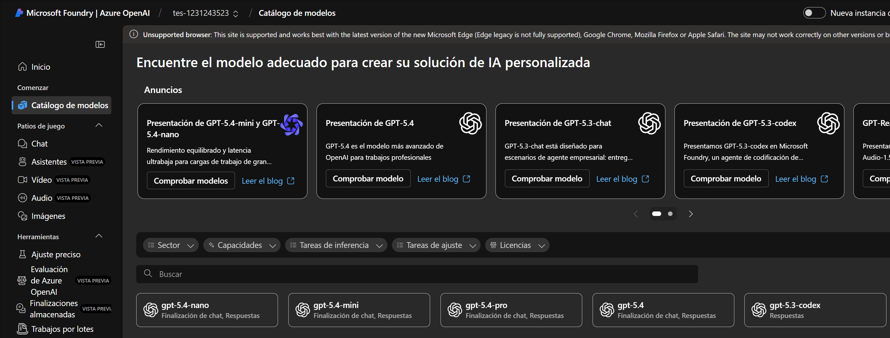

---

## PASO 10: Selección y Detalles del Modelo

Una vez que localizas el modelo en el catálogo (Paso anterior), entrarás a su ficha técnica. 

* Haz clic en el botón azul Usar este modelo (o Use this model). 

* Aquí puedes ver detalles importantes como el "Id. de modelo", que confirma que estás usando la versión correcta (ej. text-embedding-3-large).


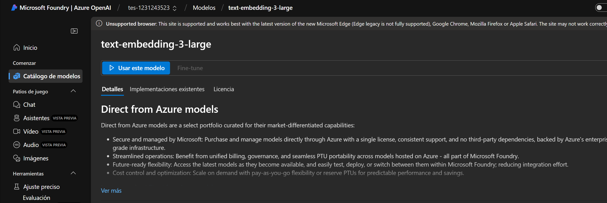

---

## PASO 11: Configuración de la Implementación

Al hacer clic en "Usar este modelo", aparecerá una ventana emergente para configurar el despliegue. 

* Nombre de la implementación: Dale un nombre sencillo. 

* Este es el nombre que irá en tu archivo .env (ej: text-embedding-3-large). 

* Tipo de implementación: Déjalo en Estándar global para asegurar disponibilidad.
  
>[!NOTE]
>En caso de que aparezca con Estandar al selecionar el Usar este modelo, dejarlo ahi

* Tokens por límite de velocidad: Puedes dejar el valor predeterminado, para este caso se uso 334K por maximidad


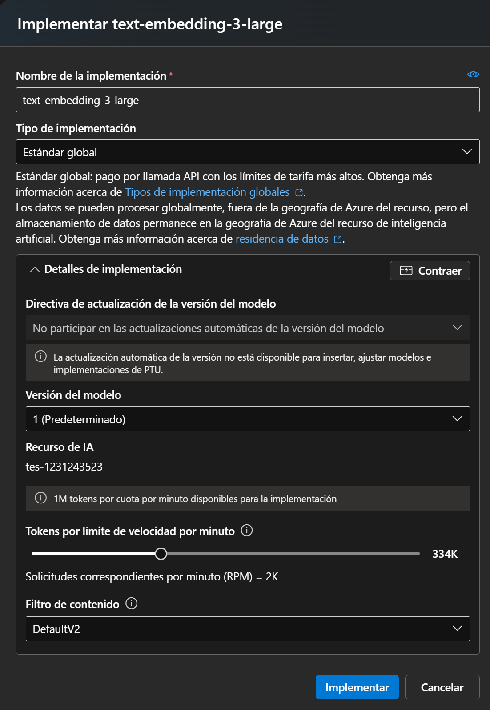

Haz clic en el botón azul Implementar.

---

## PASO 12: Obtención de Credenciales

Tras la implementación, Azure te llevará a la pantalla de Detalles de la implementación. 

* Esta es la parte más importante para tu código. Punto de conexión (Endpoint): Es la URL que aparece arriba a la izquierda. 

* Clave (API Key): Haz clic en el icono del ojo para verla y copiarla. Sección de Introducción: Azure te da un ejemplo de código en Python. 

* Fíjate que ahí mismo te indica qué api_version usar (ej: 2024-02-01 o similar).

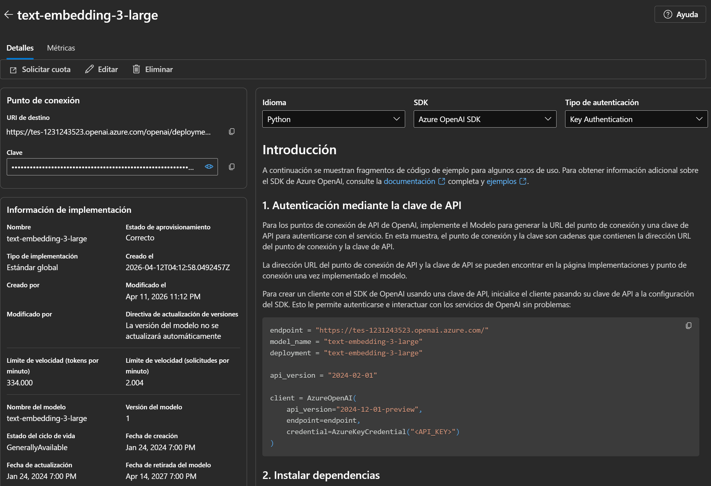

---

## PASO 13: Configurar el archivo `.env`

```env
AZURE_OPENAI_API_KEY="tu_clave_secreta_aqui" # Copia la "Clave" de la pantalla de detalles 
AZURE_OPENAI_ENDPOINT="https://tu-recurso.openai.azure.com/" # Copia el "Punto de conexión (URL) 
AZURE_OPENAI_API_VERSION="2024-02-01" # o una versión más reciente soportada 
AZURE_OPENAI_EMBEDDINGS_DEPLOYMENT="text-embedding-3-large" # El "Nombre de la implementación" que elegiste en el paso 11
```

